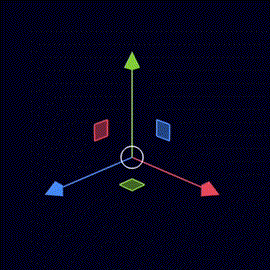
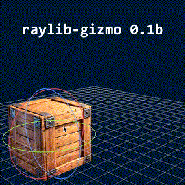

> **Note**:The [raylib-gizmo](https://github.com/cloudofoz/raylib-gizmo) library is used. This library is in **beta** Your feedback and support in enhancing its quality are greatly appreciated!

## Introduction

**ray4laz-gizmo** is a clean and customizable 3D gizmo tool for raylib. Designed with an **Immediate Mode style** for simplicity, it requires just a single function call to draw and interact.No dependencies other than raylib: just include to uses section `raygizmo.pas` in your project, and you're ready to go!

  
  
  

